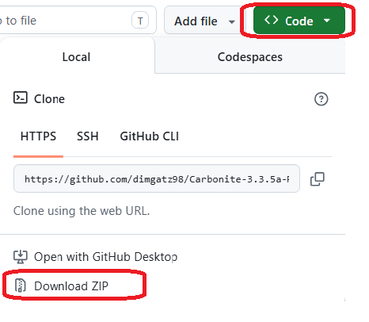

<h1 align="center">CustomWaypoints — WoW WotLK Navigator</h1>


This repository bundles a Wrath-era **Carbonite 3.3.5a** tree with **CustomWaypoints**, a companion addon that adds a modern waypoint workflow, and deep heuristic cross-continent routing.

CustomWaypoints is a custom GPS addon for players who want faster navigation, route recording, and a practical in-game map knowledge.

It was originally built to help players quickly find the best path between locations, avoid getting lost, and move efficiently between useful zones (leveling, gathering, achievements), without relying on external guides.

| Folder | What’s inside |
|--------|----------------|
| `Carbonite/` | Carbonite map/navigation addon |
| `CustomWaypoints/` | Waypoint queue, route planning, search UI, known locations, import/export, transport discovery, and Carbonite sync |
| `CarboniteTransfer/` | Related helper tooling |

For more implementation details, see the [CustomWaypoints README](CustomWaypoints/README.md).

---

## Quick Start
1. Download and unzip the projects:



2. Copy the repo folders into your WoW install under:

   ```text
   Interface\AddOns\
   ```

3. Enable **Carbonite** and **CustomWaypoints** from the AddOns screen.

4. In game, run:

   ```text
   /cw help
   ```

5. Open the CustomWaypoints UI:

   ```text
   /cw ui
   ```

6. Add a waypoint from the Carbonite map with:

   ```text
   Shift + Left Click
   ```

---

## Useful Commands

### Add coordinates on your current Carbonite map

```text
/cw <x> <y>
```

Example:

```text
/cw 52.4 71.8
```

This adds a waypoint at those zone coordinates on the current Carbonite map.

### Add coordinates in a named zone

```text
/cw <zone> <x> <y>
```

Examples:

```text
/cw Dalaran 59.6 57.4
/cw Underbelly 59.6 57.4
/cw Stormwind 62.1 31.4
```

CustomWaypoints uses smart zone-name matching against Carbonite map names. It normalizes casing, punctuation, and partial zone names where possible.

If the zone name is ambiguous, the addon will not guess silently. Use a more specific name.

### Search for a destination

```text
/cw <destination>
```

Examples:

```text
/cw doras
/cw auctioneer
/cw dalaran innkeeper
/cw my saved route
```

If the destination matches a saved route with multiple waypoints, CustomWaypoints loads the full saved route into the queue. You are routed to the start first, then through the rest of the route.

### Open Destination Search directly

```text
/cw search
/cw find
```

The search window lets you:

- browse paginated results
- double-click a result to route
- use the `Route` button for the selected result

This is especially useful for broad searches like `mailbox`, `banker`, `flight master`, or zone names with many matches.

---

## Main Workflow

### Add and follow a waypoint

```text
/cw Dalaran 59.6 57.4
/cw route
```

If auto-sync is enabled, Carbonite should receive the route automatically.

### Search and route to a known or Carbonite destination

```text
/cw doras
```

If the result is clear, the route is created immediately. If several results are equally plausible, the Destination Search window opens.

### Save your current location

```text
/cw savehere
```

or the keybind:

```text
Shift + R
```

This opens the save/metadata flow for your current player location.
This feature is mainly intended for debugging and is best used with microRouting=false, autoAdvance=false, and autoSync=false.

### Save the current queue as a reusable route

```text
/cw saveroute
```

Saved routes can later be found from Known Locations or by typing `/cw <route name>`.

### Manage saved data

```text
/cw knownlocations
```

or 

```
Shift + G
```

Use this window to browse, edit, delete, import, export, and route to saved known locations and routes.

---

## Keyboard Shortcuts

| Shortcut | Action |
|----------|--------|
| **Shift + Left Click** | Capture waypoint from the Carbonite world map |
| **Ctrl + Shift + Left Click** | Capture waypoint with metadata |
| **Ctrl + Shift + Z** | Undo last queue action |
| **Ctrl + Shift + Y** | Redo last undone queue action |
| **Shift + R** | Save waypoint at current player location (`Save Here`) |
| **Shift + G** | Open Known Locations |
| **Esc** | Close the most recently opened CustomWaypoints UI frame |
| **Shift + Delete** | Delete selected entry in Known Locations |
| **Ctrl + Shift + C** | Clear queue |

> Some keybinds may not fire if another addon or WoW binding already owns them.

---

## Feature Overview

### Waypoint queue and Carbonite sync

- Build a queue of one or more waypoints.
- Sync the queue into Carbonite for display and guidance.
- Auto-advance when reaching the active destination.
- Undo/redo queue changes.

### Destination search

- `/cw <dest>` searches for destination `<dest>`.
- Searches Known Locations, saved routes, Carbonite favorites, and Carbonite Guide POIs.
- Ambiguous searches open a paginated result window.

### Smart coordinate input

- `/cw <x> <y>` adds coordinates on the current map.
- `/cw <zone> <x> <y>` resolves a named Carbonite zone and adds the point there.

### Known Locations and saved routes

- Save single locations and multi-stop routes.
- Import/export route data.
- Route to a saved location or a full saved route.
- Use the Known Locations UI as the main management surface for saved data.

### Transport-aware routing

- Supports learned transports, portals, boats, zeppelins, trams, taxis, and manually saved route links.
- Can discover and confirm transport-like transitions during gameplay.
- Reuses validated map knowledge to improve future routes.

### Routing modes

CustomWaypoints supports two routing styles:

#### Minimal mode

Minimal mode keeps Carbonite in the lead and uses simplified route anchors mainly for cross-continent routing. This is the safest mode for normal use.

```text
/cw minimal
```

#### Deep mode

Deep mode uses CustomWaypoints' graph-based routing and transport knowledge more aggressively. It can produce better multi-map routes.

```text
/cw deep
```

Use deep mode for richer transport routing. Use minimal mode when you want the most stable everyday behavior.

---

## Important Notes

- Routes shown while flying on a Flight Master may not always reflect the real taxi path.
- Questie may affect the map when used alongside Carbonite and CustomWaypoints.

---

## Map Data Collection

CustomWaypoints is also a practical map-data collection project for WotLK 3.3.5a.

Many useful routes are not represented cleanly by static map data: dungeon entrances, portals, boats, zeppelins, city passages, private-server quirks, and zone transitions often need real in-game validation.

By saving and sharing known routes, players can gradually build a better navigation layer on top of Carbonite.

Current exported route data can live here:

```text
CustomWaypoints/data/known_routes_export.txt
```

Small additions help: a corrected entrance, a reliable portal, a working transport, or a useful city path can make routing better for everyone.

> If you import shared data, review it first. Some routes may include Flight Master links or transports your character has not discovered.

---

## Developer Notes

Maintenance notes and invariants live in:

```text
CustomWaypoints/CHECKPOINT.md
CustomWaypoints/docs/invariants.md
```

For routing changes, keep the scope small and preserve the distinction between minimal and deep mode. CustomWaypoints should extend Carbonite safely, not replace it wholesale.

## Contact & Feedback

For bug reports, suggestions, or questions about CustomWaypoints:

- Open an issue in this repository
   - GitHub: https://github.com/dimgatz98/Carbonite-3.3.5a-Remastered/issues/new
- Or reach out via:
  - Discussions: [https://github.com/dimgatz98/Carbonite-3.3.5a-Remastered/discussions](https://github.com/dimgatz98/Carbonite-3.3.5a-Remastered/discussions)

Please include:
- What you were trying to do
- What happened instead
- Any relevant `/cw` output or screenshots

---

## Support the project

If you find CustomWaypoints useful, you can support its development:

☕ https://buymeacoffee.com/baddcafe

Every bit of support helps.
